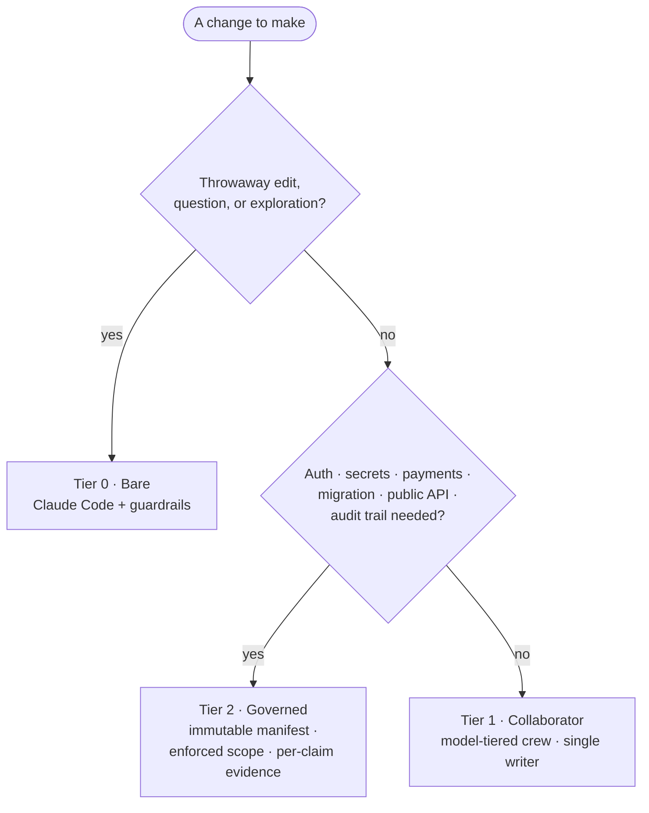

# Provost

**Match oversight to blast radius.** — a governance framework for Claude Code agents.

*[中文說明 →](README.zh-TW.md)*

---

When you let an AI agent write code, the risk that matters isn't the typo fix —
it's the auth change, the migration, the public API. **Provost is a governance
framework for Claude Code agents**: it lets you dial up *enforced* accountability
as a change's blast radius rises.

At the high end, an agent works under an immutable manifest, is **physically
blocked** from editing outside an approved set of files, and **can't declare a task
done without evidence**. Below that sits an ordinary coordinated crew for everyday
work; and at the bottom, bare Claude Code for throwaway tasks. One dial, three
tiers, matched to what's at stake.

It runs on **vanilla Claude Code** and is **model-agnostic** — put your strongest
model in the orchestrator seat and cheaper models on the volume work.



## The dial

| Tier | What it is | Use it for |
|---|---|---|
| **2 · Governed** — *the reason Provost exists* | Immutable manifest, engine-enforced write scope, path custody, per-claim evidence, fresh verifier. | Auth, secrets, payments, migrations, public APIs — anything you'll be audited on. |
| **1 · Collaborator** | A crew of model-tiered subagents, one active writer, a finite Completion Contract. | Everyday features and bug fixes. |
| **0 · Bare** | Just Claude Code with guardrails — no crew, no ceremony. | Throwaway edits, questions, exploration. |

Tiers 0–1 are the well-trodden base you escalate *from* (see
[Prior art](#prior-art--positioning)). What Provost adds that others don't is
**Tier 2** — turning "the agent promised to stay in scope" into "the agent was
*prevented* from leaving it." See [`docs/concepts.md`](docs/concepts.md) for the
full model and the decision rule.

## Tier 2 — governance (the differentiator)

For a high-blast-radius change, agreeing on scope isn't enough; you want it
enforced, and you want a trail you can reconstruct. The governed tier adds:

- an **immutable manifest** pinned to the approved plan — no quiet goal-post moves;
- a `PreToolUse` hook that **blocks any write outside the running task's literal
  `write_set`, at the engine level** — not by asking the agent nicely;
- **path custody** so files don't drift when one task hands off to another;
- **per-claim evidence** and a **fresh-context verifier** that must pass before a
  run can be marked complete;
- a **failure-signature diagnosis gate** so a repeated failure can't be retried
  forever without a written, falsifiable diagnosis;
- an append-only **JSONL ledger** and immutable handoff receipts.

**When the governed tier earns its ceremony:**

> - *Changing auth, secrets, or payments* — the agent is physically blocked from
>   editing outside the approved files, and every step leaves an auditable trail.
>   *(engine-enforced write scope + ledger)*
> - *A schema or data migration across many files* — dependent tasks hand off under
>   path custody with pinned hashes, and each claim carries its own evidence, so
>   nothing drifts and nothing is taken on faith. *(path custody + per-claim evidence)*
> - *An agent flailing on the same error* — it can't retry the identical failure
>   forever; the same failure signature twice forces a written, falsifiable
>   diagnosis before another attempt. *(failure-signature diagnosis gate)*

Design and a reference implementation: [`docs/governance/`](docs/governance/).

**Availability:** the governed tier ships today as a **design plus a
Windows/PowerShell reference implementation**; a clean, cross-platform, runnable
port is the Phase B goal. The collaborator tier below **runs today on any
platform**.

## Quickstart — Tier 1 (runs today, any platform)

The collaborator crew runs on vanilla Claude Code; no proxy, no extra services.

1. Copy the role files into your project (or `~/.claude/`):
   ```bash
   cp -r .claude/agents/ your-project/.claude/agents/
   ```
2. Merge [`orchestration.md`](orchestration.md) into your project's `CLAUDE.md`
   (or `~/.claude/CLAUDE.md`).
3. Run Claude Code with your strongest model as the main/orchestrator agent and
   work as usual — plan first, then let the crew execute. The main agent delegates
   read-only work to `explorer` and the reviewers, keeps one active writer, and
   stops when the Completion Contract is met.

The roles pin models to match cost to the job — cheap models for grunt work, the
strongest model reserved for judgment (orchestrating and reviewing):

| Role | Model | |
|---|---|---|
| `explorer` | haiku | read-only evidence gathering |
| `implementer` / `implementer-deep` | sonnet / opus | bounded TDD writers |
| `test-analyst` | haiku | runs existing tests, never edits |
| `code-reviewer` / `architecture-reviewer` | opus | read-only review |

Roles name a *job*, not a model. Swap in whatever models you like — Opus, Fable 5,
or (via a router) a non-Anthropic model — and re-assign roles to models as new ones
ship. That mapping is config; the framework doesn't change.

> _Demo: terminal recording coming — a strong orchestrator directing Haiku/Sonnet workers on a real task._

## Running other models

Provost is prompts, roles, and a governance design — nothing is tied to a vendor.
The examples use native Anthropic models so anyone can reproduce them. To run other
models behind Claude Code, point it at any Anthropic-compatible gateway with a
router such as [CC Switch](https://github.com/farion1231/cc-switch) or
[CLIProxyAPI](https://github.com/router-for-me/CLIProxyAPI) — an external choice
Provost neither ships nor endorses.

Running GPT-5.6 Sol and finding it rough? It's better-behaved than its reputation
once you pin models per role, fix the context ceiling, and hold it to an enumerable
Completion Contract — see [field notes](docs/field-notes.md).

## Also here

- [`docs/field-notes.md`](docs/field-notes.md) — hard-won operational notes on
  running Claude Code (the context-window internals; the bundled `claude-api` skill
  that can blow your window in one message).
- [`skills/`](skills/) — the methodology skills the crew uses (TDD, bug diagnosis,
  review, verification-before-completion). Some are vendored from third-party MIT
  projects; see [`skills/NOTICE.md`](skills/NOTICE.md).

## Prior art & positioning

Provost stands on native Claude Code primitives — subagents, hooks, skills. The
**collaborator tier** (a strong model orchestrating cheaper ones) is a pattern
others do well, and they're worth knowing:

- **[pilotfish](https://github.com/Nanako0129/pilotfish)** focuses on the *cost*
  angle — a benchmarked frontier-orchestrator + cheap-worker split, with a polished
  installer.
- **[claude-agent-team](https://github.com/ek33450505/claude-agent-team)** focuses
  on *observability* — a queryable local record of every session.

Provost's distinct contribution is the **governed tier**: proactive,
engine-enforced scope and evidence-based completion. Where those tools make the
crew cheaper or more observable, Provost makes it **accountable** — and the three
angles combine cleanly (cost + record + governance).

## Roadmap

- **Phase A (now):** the collaborator tier as a runnable, cross-platform drop-in;
  the governed tier as design + a Windows/PowerShell reference implementation.
- **Phase B:** a clean, cross-platform, model-agnostic port of the governed tier as
  an installable tool; possibly a UI for composing role catalogs.

## License

MIT — see [`LICENSE`](LICENSE). Vendored skills retain their original MIT
attribution in [`skills/NOTICE.md`](skills/NOTICE.md).
