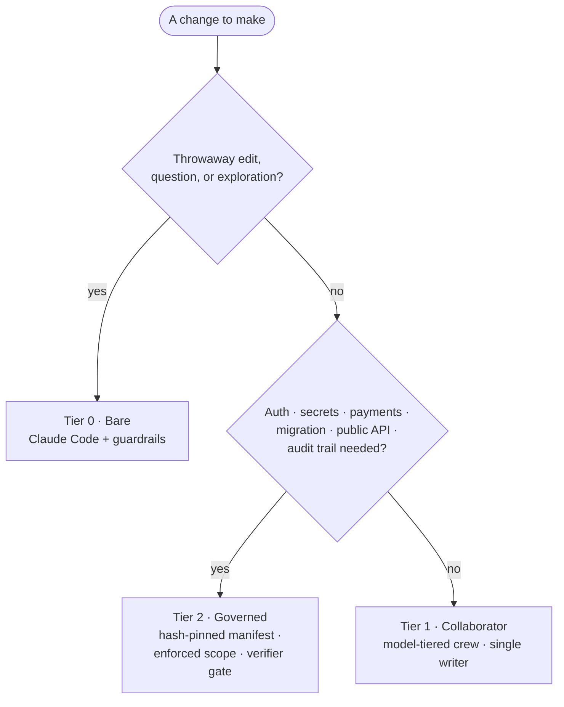

# Provost

**Match oversight to blast radius.** — graduated governance for coding-agent work.

*[中文說明 →](README.zh-TW.md)*

Provost is a governance framework for deciding how much oversight an AI coding
task needs and making high-risk work more accountable. A typo does not need the
same process as an authentication change, a migration, or a public API change.
Provost provides three tiers so the process can rise with the potential damage.

The governance model is model-agnostic. The current reference host and
integrations target **Claude Code**, and the shipped role files use Claude model
identifiers. Broader agent-host compatibility is planned, not claimed as
available today.

## Why this exists

Prompt instructions are useful, but an agent can misunderstand or ignore them.
For high-blast-radius work, Provost explores stronger controls: a plan is pinned
to a manifest, file writes are checked against an approved set, handoffs retain
path custody, and completion passes through declared verifier tasks.

That makes Provost more than a prompt collection. Its Tier 2 reference code
contains lifecycle state, manifest hashing, write-gate decisions, workspace
snapshots, custody records, failure signatures, and an audit ledger. The current
implementation is deliberately described as a reference implementation because
the repository does not yet ship its original launcher or a turnkey installer.

## The dial

| Tier | What it is | Use it for |
|---|---|---|
| **0 · Bare** | Claude Code with local guardrails; no crew or governance runtime. | Throwaway edits, questions, and exploration. |
| **1 · Collaborator** | A coordinated role pack, one-active-writer policy, and a finite Completion Contract. | Everyday features and bug fixes. |
| **2 · Governed** | A hash-pinned manifest, hook-enforced write scope, path custody, verifier tasks, and an audit trail. | Auth, secrets, payments, migrations, public APIs, and other high-risk work. |



See [the concepts guide](docs/concepts.md) for the decision rule and the intended
boundaries between tiers.

## Project status

### Available now

- Six Claude Code role definitions under [`.claude/agents/`](.claude/agents/).
- The Tier 1 [orchestration policy](orchestration.md), including plan-first work,
  one active writer, and evidence-based completion discipline.
- Reusable methodology [skills](skills/) for TDD, diagnosis, review, and
  verification, with third-party attribution preserved in
  [`skills/NOTICE.md`](skills/NOTICE.md).
- A dependency-free test that exercises the Tier 2 write-gate decision logic on
  Windows; see the [governed write-scope demo](docs/examples/governed-write-scope-demo.md).

### Experimental / reference implementation

- The Windows/PowerShell Tier 2 lifecycle helper and Claude Code hook scripts in
  [`docs/governance/reference/`](docs/governance/reference/).
- Hash checks detect changes to an approved manifest, and the helper requires a
  new revision for changed intent; the file is not made immutable by the
  operating system.
- The `PreToolUse` write gate returns a machine-readable deny decision for an
  `Edit`, `Write`, or `NotebookEdit` target outside a running task's literal
  `write_set` when the hook is installed and the governed environment is active.
- The helper implements workspace snapshots, path-custody hashes, task state,
  failure-signature handling, verifier-task completion gates, helper-appended
  JSONL events, and hashed terminal handoff receipts.

### Not yet shipped

- The original launcher and ready-to-install Claude Code hook configuration.
- A clean end-to-end governed-session quickstart or packaged runtime.
- Complete per-claim evidence binding. Acceptance entries are validated, and a
  task may record a verification summary, but the helper does not yet require a
  separate evidence record for every acceptance claim.
- Linux/macOS support and adapters for additional coding-agent environments.

See the [governance capability matrix](docs/governance/README.md) and
[`ROADMAP.md`](ROADMAP.md) for the exact implementation boundary and next steps.

## Try it

### Tier 1 collaborator workflow

The collaborator workflow uses vanilla Claude Code and needs no proxy or extra
service:

1. Copy the role files into your project (or your user-level `.claude` directory):

   ```bash
   cp -r .claude/agents/ your-project/.claude/agents/
   ```

2. Merge [`orchestration.md`](orchestration.md) into the project's `CLAUDE.md`.
3. Start with a plan and a finite Completion Contract. Delegate read-only
   exploration and review as needed, while keeping exactly one active writer.

The shipped role mapping is:

| Role | Current model ID | Responsibility |
|---|---|---|
| `explorer` | haiku | Read-only evidence gathering |
| `implementer` / `implementer-deep` | sonnet / opus | Bounded TDD implementation |
| `test-analyst` | haiku | Existing test execution without source edits |
| `code-reviewer` / `architecture-reviewer` | opus | Read-only assurance |

These are configuration choices, not portable model abstractions. You can edit
the role mapping for another model available to your Claude Code environment;
Provost does not ship or certify a third-party gateway.

### Tier 2 write-scope decision

On Windows, run:

```powershell
powershell.exe -NoProfile -File .\tests\governance\Test-WriteScope.ps1
```

The test constructs an isolated manifest and active-run lock, invokes the shipped
hook through its stdin protocol, confirms an approved path is allowed, and
confirms out-of-scope and invalid-state writes are denied. It does not modify the
repository. Full prerequisites, expected output, and limitations are documented
in the [demo walkthrough](docs/examples/governed-write-scope-demo.md).

## Tier 2 governance details

The governed tier's reference design covers:

- **Hash-pinned manifests:** approved content is hashed and checked through the
  lifecycle; changed scope requires a new revision.
- **Write-scope decisions:** the write hook fails closed and denies paths outside
  a running task's literal `write_set`.
- **Path custody:** shared writer paths require dependency ordering and recorded
  content evidence at handoff.
- **Completion gating:** a successful run requires every declared task, including
  required verifier tasks, to have reached `PASS`.
- **Failure control:** repeated failure signatures can require new diagnosis
  evidence before another revision proceeds.
- **Audit artifacts:** lifecycle actions append JSONL events; terminal handoff
  receipts pin the manifest, ledger, and workspace snapshot by hash.

These controls become engine-enforced only when the hooks are registered with
Claude Code and the required `PROVOST_*` environment is set by a launcher. The
launcher/configuration is not part of this public repository yet. Read the
[governance documentation](docs/governance/README.md) before evaluating or
adapting the reference implementation.

## Running other models

The governance concepts do not depend on a model's reasoning style. The shipped
integration does depend on Claude Code interfaces. If you choose to place another
model behind an Anthropic-compatible gateway, that gateway is an external part of
your setup; Provost neither ships nor endorses one. Operational observations from
such setups are recorded separately in [field notes](docs/field-notes.md).

## Prior art and positioning

Provost builds on native Claude Code primitives—subagents, hooks, and skills. The
collaborator pattern is well explored elsewhere:

- [pilotfish](https://github.com/Nanako0129/pilotfish) focuses on the cost split
  between a frontier orchestrator and cheaper workers.
- [claude-agent-team](https://github.com/ek33450505/claude-agent-team) focuses on
  local session observability.

Provost's focus is graduated governance: increasing oversight with blast radius
and exploring enforceable scope, custody, verification, and auditability for the
highest tier.

## Contributing

Bug reports, governance proposals, documentation improvements, tests, packaging,
and cross-platform work are welcome. Start with [`CONTRIBUTING.md`](CONTRIBUTING.md)
and keep pull requests narrowly scoped. Changes must not silently weaken a stated
governance guarantee.

## License

MIT — see [`LICENSE`](LICENSE). Vendored skills retain their original MIT
attribution in [`skills/NOTICE.md`](skills/NOTICE.md).
