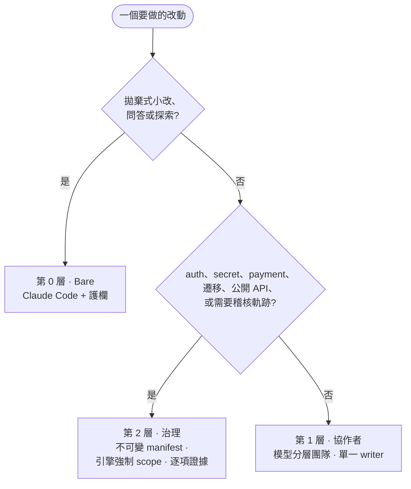

# Provost

**Match oversight to blast radius.**（依風險調節監督強度）— 給 Claude Code agent 的治理框架。

*[English →](README.md)*

---

當你讓 AI agent 寫程式,真正有風險的不是改 typo——是 auth 改動、遷移、公開 API。**Provost 是給 Claude Code agent 的治理框架**:隨著一次改動的 blast radius 升高,把*被強制執行*的問責感往上調。

高端時,agent 在不可變 manifest 下工作、被**物理性擋住**不能編輯核准清單外的檔、且**沒有證據不能宣稱完成**。往下是一支處理日常工作的協作團隊;最底層是拋棄式任務用的 bare Claude Code。一把 dial、三層,對上賭注大小。

它跑在**原生 Claude Code** 上、是 **model-agnostic** 的——把你最強的模型放在指揮位,便宜模型做大量工作。



## 這把 dial

| 層 | 是什麼 | 何時用 |
|---|---|---|
| **2 · 治理** — *Provost 存在的理由* | 不可變 manifest、引擎強制 write-scope、path custody、逐項證據、fresh verifier。 | auth、secret、payment、遷移、公開 API——任何你會被稽核的事。 |
| **1 · 協作者** | 模型分層的 subagent 團隊、單一 active writer、有限的 Completion Contract。 | 日常功能與 bug fix。 |
| **0 · Bare** | 只有 Claude Code + 護欄,無團隊、無儀式。 | 拋棄式小改、問答、探索。 |

第 0–1 層是你**往上 escalate 的業界底座**(見下方「相關工作與定位」)。Provost 加的、別人沒有的是**第 2 層**——把「agent 答應會待在 scope 內」變成「agent 被*擋住*出不去」。完整模型與決策規則見 [`docs/concepts.md`](docs/concepts.md)。

## 第 2 層——治理(差異化所在)

高 blast radius 的改動,口頭同意 scope 不夠;你要它被強制執行,還要一條能重建的軌跡。治理層加了:

- **不可變 manifest**,釘死在核准的計畫上——不能偷偷移動球門;
- 一個 `PreToolUse` hook,**在引擎層擋掉任何超出當前 task literal `write_set` 的寫入**——不是好聲好氣拜託 agent;
- **path custody**,讓一個 task 交棒給下一個時檔案不漂移;
- **逐項證據**與一個必須通過才算完成的 **fresh-context verifier**;
- **failure-signature 診斷閘**,讓同一個失敗不能無限重試而不附可證偽的診斷;
- append-only 的 **JSONL ledger** 與不可變的交接 receipt。

**治理層什麼時候值得那套儀式:**

> - *改 auth、secret、payment* — agent 被物理性擋住不能編輯核准外的檔,每步留可稽核軌跡。*(引擎強制 write-scope + ledger)*
> - *跨多檔的 schema/資料遷移* — 相依 task 以 pinned hash 做 path custody 交棒,每項 claim 各自帶證據,所以不漂移、不靠信任。*(path custody + 逐項證據)*
> - *agent 在同一個錯上鬼打牆* — 不能對同一個失敗無限重試;同一 failure signature 出現兩次,就強制先寫出可證偽的診斷才能再試。*(failure-signature 診斷閘)*

設計與 reference 實作:[`docs/governance/`](docs/governance/)。

**現況**:治理層目前以**設計 + 一份 Windows/PowerShell reference 實作**呈現;乾淨、跨平台、可跑的 port 是 Phase B 目標。下方的協作層**今天就能跑、跨平台**。

**想在 macOS/Linux 上跑治理層?**[開一個 issue](https://github.com/norton77930/Provost/issues/new)——需求決定 Phase B port 要不要做。

## 快速開始——第 1 層(今天可跑、跨平台)

協作團隊跑在原生 Claude Code 上;不需要 proxy、不需要額外服務。

1. 把角色檔複製進你的專案(或 `~/.claude/`):
   ```bash
   cp -r .claude/agents/ your-project/.claude/agents/
   ```
2. 把 [`orchestration.md`](orchestration.md) 併進你專案的 `CLAUDE.md`(或 `~/.claude/CLAUDE.md`)。
3. 用你最強的模型當主/指揮代理跑 Claude Code,照常工作——先計畫,再讓團隊執行。主代理把唯讀工作委派給 `explorer` 與 reviewer、維持單一 active writer,並在 Completion Contract 達成時停手。

角色以釘死的模型讓成本對上任務——便宜模型做粗活,最強的模型只留給需要判斷的事(指揮與 review):

| 角色 | 模型 | |
|---|---|---|
| `explorer` | haiku | 唯讀蒐證 |
| `implementer` / `implementer-deep` | sonnet / opus | 有界的 TDD writer |
| `test-analyst` | haiku | 只跑既有測試,絕不改檔 |
| `code-reviewer` / `architecture-reviewer` | opus | 唯讀 review |

角色講的是*工作*,不是模型。你想換什麼模型都行——Opus、Fable 5,或(透過 router)非 Anthropic 模型——並在新模型出來時把角色重新指派給模型。那個對應是 config;框架不變。

**一次 run 長什麼樣** *(完整 terminal 錄影製作中)* — 一個 Tier 1、修一行 bug 的 run,大致像這樣:

```text
你           ▸「/login 偶發 500,當 email 尾端有空白時」
explorer     ▸(haiku) 定位:session lookup 前沒有 trim email
plan         ▸ Completion Contract — 1 條 claim:「login 會 trim email」;證據:一個 失敗→通過 的測試
implementer  ▸(sonnet)RED:針對尾端空白 email 的測試 → 失敗
             ▸ GREEN:lookup 前先 trim → 測試通過
test-analyst ▸(haiku) 跑 auth 測試套件 → 綠燈,無 regression
reviewer     ▸(opus)  確認 claim、檢查有無 scope creep → 乾淨
done         ▸ 契約達成 → 收手。Opus 只花在判斷上。
```

全程單一 writer;貴模型負責指揮與 review,便宜模型做量。

## 接其他模型

Provost 就是提示詞、角色定義與一套治理設計——沒有任何一部分綁死廠商。範例用原生 Anthropic 模型,任何人都能重現。想在 Claude Code 後面跑其他模型?用 [CC Switch](https://github.com/farion1231/cc-switch) 或 [CLIProxyAPI](https://github.com/router-for-me/CLIProxyAPI) 之類的 router,指向任何 Anthropic 相容 gateway 即可——那是外部選擇,Provost 不 ship、也不背書。

跑 GPT-5.6 Sol 覺得難搞?釘好每個角色的模型、修好 context ceiling、用可列舉的 Completion Contract 框住它,就比傳聞乖得多——見 [field notes](docs/field-notes.md)。

## 這裡還有

- [`docs/field-notes.md`](docs/field-notes.md) — 把 Claude Code 操到極限的踩雷筆記(context window 內部行為;會一則訊息撐爆視窗的內建 `claude-api` skill)。
- [`skills/`](skills/) — 團隊用的方法論 skills(TDD、bug 診斷、review、完成前驗證)。部分 vendored 自第三方 MIT 專案,見 [`skills/NOTICE.md`](skills/NOTICE.md)。

## 相關工作與定位

Provost 建在原生 Claude Code primitives 上——subagents、hooks、skills。**協作層**(強模型指揮便宜模型)是別人也做得好的模式,值得認識:

- **[pilotfish](https://github.com/Nanako0129/pilotfish)** 主打*成本*——有 benchmark 的「前沿指揮 + 便宜執行」拆分,加一個完整的 installer。
- **[claude-agent-team](https://github.com/ek33450505/claude-agent-team)** 主打*可觀測性*——每個 session 的可查詢本機紀錄。

Provost 獨有的貢獻是**治理層**:主動、引擎強制的 scope 與證據導向的完成。當那些工具讓團隊更便宜或更可觀測,Provost 讓它**可問責**——而且三個角度可以乾淨疊加(成本 + 紀錄 + 治理)。

## 路線圖

- **Phase A(現在)**:協作層做成可跑、跨平台的 drop-in;治理層以設計 + 一份 Windows/PowerShell reference 實作呈現。
- **Phase B**:把治理層做成乾淨、跨平台、model-agnostic 的可安裝工具;可能加一個組角色目錄的 UI。

## 授權

MIT — 見 [`LICENSE`](LICENSE)。Vendored skills 保留其原始 MIT 歸屬於 [`skills/NOTICE.md`](skills/NOTICE.md)。
