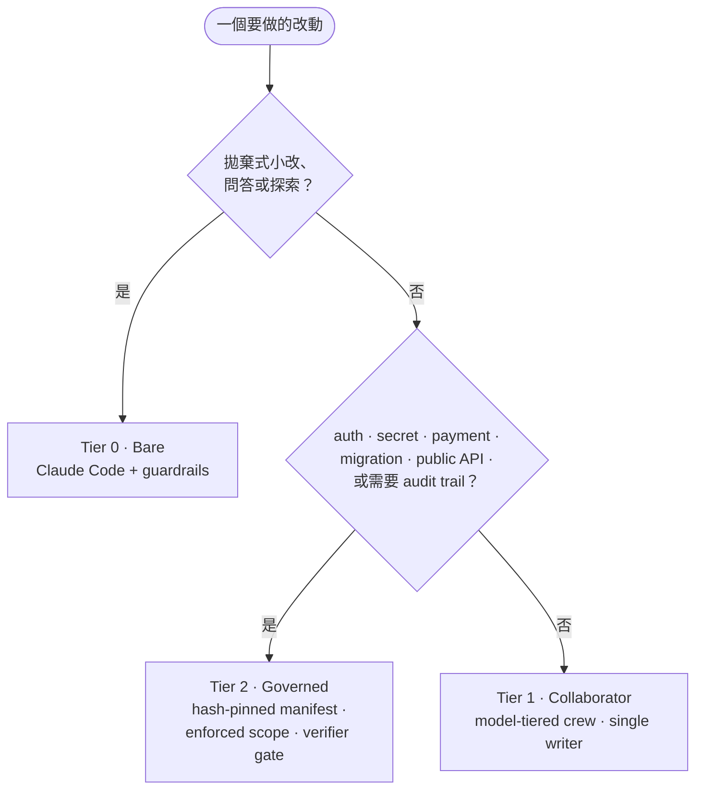

# Provost

**Match oversight to blast radius.**（依風險調節監督強度）— AI coding agents 的分級治理框架。

*[English →](README.md)*

Provost 用來判斷一次 AI coding 任務需要多少監督，並讓高風險工作更可問責。修 typo 不需要和 auth 改動、migration 或 public API 變更一樣的流程；Provost 提供三個 tier，讓治理成本跟著可能造成的損害上升。

治理模型本身是 host-agnostic；目前的 reference host 是 **Claude Code**，交付的 role files 也使用 Claude model identifiers，對其他 agent host 的支援是規劃方向，不是現在已可用的能力。

Tier 2 是寫成 code 的 reference implementation，不是一份說明：其中包含 lifecycle state、manifest hashing、write-gate decisions、workspace snapshots、custody records、failure signatures 與 audit ledger。這是它和「一包 prompts」的差別。

## 現在可用

- [`agents/`](agents/) 下的六個 Claude Code role definitions，可用 plugin 安裝（見下方「安裝」）。
- Tier 1 [`orchestration.md`](orchestration.md)：plan-first、單一 active writer 與 evidence-based completion discipline，由 plugin 直接送進每個 session，不需手動合併。
- [`skills/`](skills/) 中的 TDD、診斷、review 與完成前驗證方法；第三方歸屬保留於 [`skills/NOTICE.md`](skills/NOTICE.md)。
- Windows launcher：開啟治理 session、為該 session 註冊 Tier 2 hooks、在無法執行 enforcement 時拒絕啟動；`Initialize` 會要求 hooks 確實執行過的證據。
- Windows 上涵蓋全部七項 Tier 2 治理決策的 decision test，每項都有 demo walkthrough（見下方「Tier 2 reference 檢查」）。

## 為什麼需要 Provost

Prompt 指示很有用，但 agent 可能誤解或忽略。對高 blast-radius 工作，Provost 探索更強的控制：把核准計畫釘在 manifest、依允許清單檢查檔案寫入、在交接時保留 path custody，並讓完成狀態經過宣告好的 verifier tasks。

目前仍應把它視為 reference implementation。launcher 已交付，治理 session 在 Windows 上已驗證可端到端執行，但沒有 turnkey installer，Linux 與 macOS 仍不執行 enforcement。

## 三級治理

| Tier | 是什麼 | 適用情境 |
|---|---|---|
| **0 · Bare** | Claude Code 加上本機 guardrails；沒有 crew 或 governance runtime。 | 拋棄式小改、問答與探索。 |
| **1 · Collaborator** | 一組協作 roles、單一 active writer policy 與有限的 Completion Contract。 | 日常 feature 與 bug fix。 |
| **2 · Governed** | Hash-pinned manifest、hook-enforced write scope、path custody、verifier tasks 與 audit trail。 | Auth、secret、payment、migration、public API 等高風險工作。 |



完整決策規則與各 tier 邊界見 [`docs/concepts.md`](docs/concepts.md)。

## 專案狀態

現在已經可用的部分列在上方「現在可用」一節；Tier 2 其餘部分屬於 reference implementation，已知落差集中在下方「Roadmap／已知限制」。

### Experimental／reference implementation

- [`docs/governance/reference/`](docs/governance/reference/) 中的 Windows/PowerShell Tier 2 lifecycle helper 與 Claude Code hook scripts。
- Hash checks 能偵測已核准 manifest 被變更；變更 intent 必須建立新 revision，但作業系統並沒有把檔案設成不可修改。
- 當 hook 已安裝且 governed environment 啟用時，`PreToolUse` write gate 會對不在 running task literal `write_set` 內的 `Edit`、`Write` 或 `NotebookEdit` target 回傳 machine-readable deny。
- Helper 實作 workspace snapshots、path-custody hashes、task state、failure-signature handling、verifier-task completion gates、由 helper append 的 JSONL events，以及 hashed terminal handoff receipts。

## 安裝

Provost 以 Claude Code plugin 形式交付：

```bash
claude plugin marketplace add norton77930/Provost
claude plugin install provost@provost
```

在 session 內也可以用 `/plugin marketplace add` 與 `/plugin install`。

安裝後會得到六個 collaborator roles、六個 methodology skills 與 orchestration policy。policy 透過 `SessionStart` hook 進入每個 session，不需要手動合併進 `CLAUDE.md`。

Collaborator tier 就是單純的 Claude Code 設定：Claude Code 能跑的地方它就能跑，不需要 proxy、gateway 或額外服務。下方的 Tier 2 reference runtime 目前僅支援 Windows。

若要改用本機工作副本而非發布版：

```bash
claude --plugin-dir .
```

### plugin 交付的內容

| Role | Model | 職責 |
|---|---|---|
| `explorer` | haiku | 唯讀 evidence gathering |
| `implementer` / `implementer-deep` | sonnet / opus | 有界的 TDD implementation |
| `test-analyst` | haiku | 不改 source 的既有測試執行 |
| `code-reviewer` / `architecture-reviewer` | opus | 唯讀 assurance |

這些是設定選擇，不是 portable model abstractions。你可以依 Claude Code environment 可用的 model 調整 mapping；Provost 不交付或認證第三方 gateway。

隨附的六個 methodology skills 涵蓋 TDD、bug 診斷、design grilling、two-axis review 與完成前驗證。第三方歸屬見 [`skills/NOTICE.md`](skills/NOTICE.md)。

## 如何試用

從一份計畫與有限的 Completion Contract 開始。視需要委派唯讀的探索與審查，並保持恰好一位 active writer。crew 遵循的是 [orchestration policy](orchestration.md)，[concepts guide](docs/concepts.md) 說明何時該在 tier 之間移動。

## 開啟治理 session（Windows）

```powershell
.\docs\governance\reference\Start-GovernedSession.ps1 -WorkspaceRoot D:\path\to\repo
```

launcher 會設好 hooks 讀取的 `PROVOST_*` environment，並透過 `claude --settings` **只為該 session** 註冊 Tier 2 hooks。刻意不由 plugin 註冊：每個 hook 在每次符合的工具呼叫都要啟動一個 PowerShell 行程，而 plugin 是裝給所有人的，其中多數人不會開治理 session。

遇到 workspace 不是 Git repository、治理 hook 缺失或無法解析、或沒有 PowerShell 直譯器時，它會拒絕而不是繼續。最後一項最關鍵:找不到直譯器的 hook 不會擋任何東西也不會報錯，session 會自稱受治理卻什麼都沒執行。

剩下的檢查在 `Initialize`：除非 `SessionStart` hook 已寫下標記該 session 的 liveness marker，否則拒絕開啟 run。這個 marker 是「hooks 確實載入並執行過」的證據，不是憑證——它是 workspace 裡的一個純文字檔，任何能寫入 workspace 的東西都寫得出來。它擋的是設定錯誤的 session，不是刻意說謊的 session。

## Tier 2 reference 檢查（Windows）

每項治理決策也各有一個獨立檢查，是不開 session 就能觀察單一決策的最快方式。每項檢查都會建立隔離的 workspace，透過真實介面驅動所交付的 hook 或 helper，且不修改 repository。

在 repo 根目錄、Windows 上：

```powershell
powershell.exe -NoProfile -File .\tests\governance\Test-WriteScope.ps1
```

| 決策 | 檢查 | 需要 `git` | 說明 |
|---|---|---|---|
| Write scope | `Test-WriteScope.ps1` | 否 | [demo](docs/examples/governed-write-scope-demo.md) |
| Ref guard | `Test-RefGuard.ps1` | 否 | [demo](docs/examples/governed-ref-guard-demo.md) |
| Manifest pin | `Test-ManifestPin.ps1` | 是 | [demo](docs/examples/governed-manifest-pin-demo.md) |
| Path custody | `Test-PathCustody.ps1` | 是 | [demo](docs/examples/governed-path-custody-demo.md) |
| Completion gate | `Test-CompletionGate.ps1` | 是 | [demo](docs/examples/governed-completion-gate-demo.md) |
| Failure diagnosis | `Test-FailureDiagnosis.ps1` | 是 | [demo](docs/examples/governed-failure-diagnosis-demo.md) |
| Audit artifacts | `Test-AuditArtifacts.ps1` | 是 | [demo](docs/examples/governed-audit-artifacts-demo.md) |
| Session liveness | `Test-SessionLiveness.ps1` | 是 | — |

每份 walkthrough 記錄該檢查的前置條件、預期輸出，以及它能證明與不能證明的界線。

## Tier 2 治理細節

Governed tier 的 reference design 包含：

- **Hash-pinned manifests：** lifecycle 會檢查核准內容的 hash；scope 變更需要新 revision。
- **Write-scope decisions：** write hook fail closed，拒絕 running task literal `write_set` 外的 target。
- **Path custody：** 共用 writer path 需要 dependency ordering，交接時記錄 content evidence。
- **Completion gating：** 成功完成要求所有宣告的 tasks（包含 required verifier tasks）都達到 `PASS`。
- **Failure control：** 重複的 failure signature 可要求新的 diagnosis evidence 才能繼續下一個 revision。
- **Audit artifacts：** lifecycle actions append JSONL events；terminal handoff receipt 以 hash 釘住 manifest、ledger 與 workspace snapshot。

hooks 註冊到 Claude Code 且必要的 `PROVOST_*` environment 就緒時，這些 controls 就是 engine-enforced 行為。`Start-GovernedSession.ps1` 為單一 session 完成這兩件事，而 `Initialize` 會拒絕開啟無法證明 hooks 生效的 run。評估或移植前請先讀 [governance documentation](docs/governance/README.md)。

## 其他模型

治理概念不依賴特定模型的 reasoning style，但目前交付的 integration 依賴 Claude Code interfaces。若你自行在 Anthropic-compatible gateway 後方使用其他模型，gateway 是外部 setup；Provost 不交付也不背書。相關實務觀察另記於 [field notes](docs/field-notes.md)。

## 相關工作與定位

Provost 建在 Claude Code 的 subagents、hooks 與 skills 上。Collaborator pattern 也有其他成熟方向：

- [pilotfish](https://github.com/Nanako0129/pilotfish) 聚焦 frontier orchestrator 與較便宜 workers 的成本拆分。
- [claude-agent-team](https://github.com/ek33450505/claude-agent-team) 聚焦 local session observability。

Provost 聚焦 graduated governance：依 blast radius 提高監督強度，並在最高 tier 探索可強制的 scope、custody、verification 與 auditability。

## Roadmap／已知限制

- 打包好的 installer。launcher 以 session 為單位註冊 hooks，不寫入常駐設定。
- 每個 task 的全新 agent context——原始 launcher 有做，這一版沒有。
- 乾淨的 end-to-end governed-session quickstart 或 packaged runtime。
- 完整逐 claim evidence binding。目前 acceptance entries 會被驗證，task 也可以記錄整體 verification summary，但 helper 不要求每個 acceptance claim 都有獨立 evidence record。
- Linux/macOS support，以及其他 coding-agent environment adapters。

精確能力邊界與下一步見 [governance capability matrix](docs/governance/README.md) 與 [`ROADMAP.md`](ROADMAP.md)。

## 貢獻

歡迎 bug reports、governance proposals、文件、測試、packaging 與 cross-platform work。請先讀 [`CONTRIBUTING.md`](CONTRIBUTING.md)，保持 PR scope 精簡，且不得無聲削弱已宣告的治理保證。顯著變更見 [`CHANGELOG.md`](CHANGELOG.md)。

疑似安全漏洞請透過 [`SECURITY.md`](SECURITY.md) 的私密管道回報，不要開公開 issue。

## 授權

MIT — 見 [`LICENSE`](LICENSE)。Vendored skills 的原始 MIT 歸屬保留於 [`skills/NOTICE.md`](skills/NOTICE.md)。
