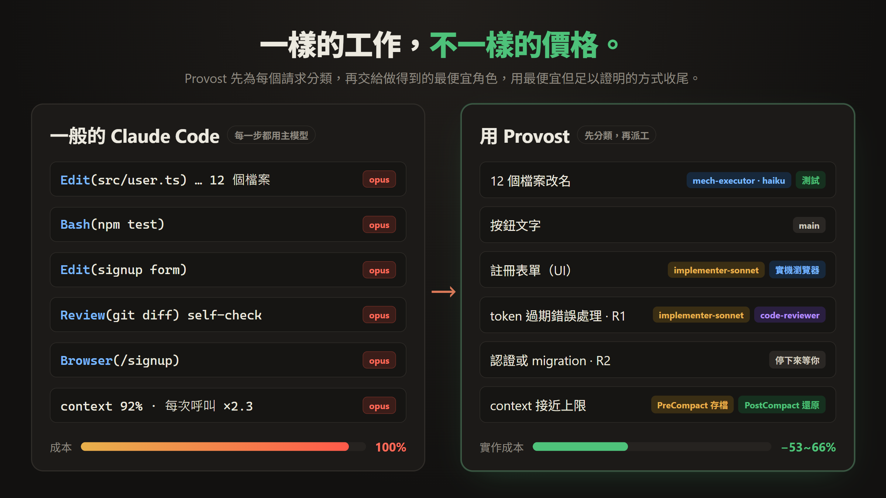

<p align="center">
  
</p>

<h1 align="center">Provost</h1>

<p align="center">
  <b>每個請求先分類&nbsp;&nbsp;|&nbsp;&nbsp;便宜的模型動手&nbsp;&nbsp;|&nbsp;&nbsp;有風險才審查&nbsp;&nbsp;|&nbsp;&nbsp;壓縮後決策還在&nbsp;&nbsp;|&nbsp;&nbsp;真實工作實測</b>
</p>

<p align="center">
  
</p>

<p align="center">
  <b>別再讓 agent 的每一步都付頂級模型的價格。</b><br>
  Claude Code 的編排政策、8 個 subagent 角色和 handoff runtime。主 session 先為每個請求分類，把動手的工作交給比較便宜的模型，並讓決策撐過 context 壓縮。
</p>

<p align="center">
  <a href="https://github.com/norton77930/Provost/actions/workflows/ci.yml"></a>
  
  <a href="LICENSE"></a>
</p>

<p align="center">
  <a href="#安裝"><b>安裝</b></a> · <a href="#為什麼不直接用-claude-code">為什麼</a> · <a href="#運作方式">運作方式</a> · <a href="#目前的證據">證據</a> · <a href="README.md">English</a>
</p>

裝好之後，照平常的方式工作。動手之前，主 session 會先宣告它打算怎麼處理每個請求：

```
> 把 12 個檔案的 getUser 改名成 fetchUser
分類:機械/無風險/證據:測試 → mech-executor
> 幫註冊表單加上驗證
分類:中等/無風險/證據:實機(瀏覽器) → implementer-sonnet，然後實機瀏覽器檢查
> 處理 API client 的 token 過期
分類:中等/R1(錯誤處理)/證據:審查 → implementer-sonnet，然後 code-reviewer
```

宣告會用你的語言寫；格式見[運作方式](#運作方式)。

整個想法，46 秒看完：

https://github.com/user-attachments/assets/bd4974d6-1f6c-481e-8c40-2c687c8536b4

<p align="center"><sub>46 秒，中文字幕，只有配樂。英文版在 <a href="README.md">README.md</a>。</sub></p>

## 為什麼不直接用 Claude Code

可以直接用。一般的 Claude Code 是很強的 agent。它自己不會做的，是決定每一步由誰來做、用什麼證明做完了，所以每一步都跑在主模型上，審查也只有在你想到要求時才會發生。

| 情況 | 一般的 Claude Code | 用 Provost |
| :--- | :--- | :--- |
| 改名牽涉 12 個檔案 | 主模型自己一個檔案一個檔案改 | Haiku 上的 `mech-executor` 做整批，由測試收尾 |
| 一個有界的功能可以開始做 | 主模型用自己的價格寫 | 交給 `implementer-sonnet`：實作成本 −53~66%，審查結果相當（34 個 slice 的試驗） |
| 改動在 UI 上看得到 | 程式碼看起來對就算完成 | 用實機瀏覽器檢查收尾，而不是派 reviewer |
| 改動牽涉錯誤處理、資料轉換或 concurrency | 你要求才會審查 | `code-reviewer` 在全新 context 裡審查；檔案數和 diff 大小從不觸發審查 |
| 改動牽涉認證、密鑰、金流或 migration | 和其他改動一樣直接進行 | R2：session 先停下來，等你決定 |
| context 長到超過 400K | 每次呼叫貴約 ×2.3，而且壓縮可能丟掉決策 | 早點壓縮：PreCompact 存下決策，PostCompact 還原（44 次壓縮，不用重新說明） |

量測結果和它的限制見[目前的證據](#目前的證據)。

## 安裝

需求：Claude Code、Python 3.11 以上；Windows 需要 Git Bash（hook 是 bash 腳本）。

```bash
git clone https://github.com/norton77930/Provost
python Provost/install.py setup
```

接著重啟 Claude Code，用 `bash ~/.claude/provost/runtime/native-pilot-v1/hooks/runtime doctor` 確認。

<details>
<summary><b>setup 會改動什麼、備份與升級</b></summary>

`setup` 一次做完安裝需要的所有步驟，加 `--dry-run` 可以先看它會做什麼：

- 把政策、角色、skill 和 runtime 複製到 `~/.claude`（和 `install` 相同）；
- `~/.claude/CLAUDE.md` 沒有標記時，在檔尾補上 `<!-- claudex-native:begin -->` / `<!-- claudex-native:end -->`（政策只會寫在兩行之間；標記格式有誤會直接拒絕）；
- `~/.claude/settings.json` 缺少的 hook 註冊會補上 6 條（內容見 [README.md 的 Install](README.md#install)）。檔案裡其他內容都保留，重新以 2 格縮排寫回；不是合法 JSON 的檔案會拒絕處理，也絕不印出檔案裡的任何值；
- `~/.claude/provost/config.json` 不存在時，寫入開啟 handoff 的預設值。

每個要改的檔案都先備份到 `~/.claude/provost/backups/install-<UTC 時間>/`，附 `manifest.json`；失敗會自動回滾。重跑 `setup` 不會再改任何東西。第一次覆蓋內容不同的本機 `skills/handoff/SKILL.md` 時，會先在旁邊另存一份 `SKILL.md.local-<UTC 時間>.bak`。`settings.json` 的備份是完整副本（含其中的憑證），備份不會自動清除。安裝程式支援 `CLAUDE_CONFIG_DIR` 和 `--config-dir`；hook 本身讀的是 `~/.claude/provost/config.json`，除非用 `PROVOST_CONFIG` 指到別處。

之後 repo 有任何變動，先跑 `python install.py check` 看和實際設定差在哪（exit 0 = 無漂移，1 = 有漂移），再用 `python install.py install` 套用；`install` 不會碰 `settings.json`。升級到 decision log 後，先跑 `migrate` 並檢視結果，再跑 `migrate --apply`，最後才 `prune --apply`（見指南的 [Install and rollout](docs/native-handoff.md#install-and-rollout)）。

</details>

## 運作方式

Provost 是一套每天實際在用的 Claude Code 設定的正本。主 session 先依難度和風險為每個請求分類：簡單的工作自己做，有界的 slice 交給比較便宜的 implementer 角色，只有在失敗「測試和實機都看不出來」時才找全新 context 的 reviewer。一個小型 runtime 會記下決策和派工，讓工作撐過 context 壓縮和 session 重啟。

它照實際使用的樣子公開：為一個人的工作調校、以 Windows 為主，用「複製檔案到 Claude 設定目錄＋漂移檢查」的方式安裝。

每個非瑣碎的請求先宣告一行分類：

```text
分類:<簡單|中等|機械|困難> / <無風險|R1|R2> / 證據:<測試|實機|審查|架構> → <路徑>
```

- **難度決定誰來實作。** 簡單的留在主 session；中等的交給 `implementer-sonnet`（方法已定、驗收清楚）或 `implementer`（還有設計選擇；concurrency、lifecycle、安全相關則用 `effort: high`）；完全指定的重複工作交給 `mech-executor`；困難的工作要先有核准的 spec。
- **風險決定用什麼證據結案。** 選「最便宜、但真的抓得到失敗」的證據：聚焦測試、實機執行，或只在兩者都看不出來時派 `code-reviewer`（動到對外介面再加 `architecture-reviewer`）。檔案數、diff 大小、「看起來很複雜」明文不是審查的理由。
- **R2 先停。** 認證、密鑰、金流、migration、破壞性 public API、跨 repo 或不可逆操作，等使用者決定，並且要審查通過後才算完成。
- **writer 有預算。** 平常最多 2 個同時寫入，第 3 個要證明完全獨立；每一波派工前都檢查檔案和共用資源的歸屬。
- **完成是有限的。** Completion Contract 列出要證明的事和證據；全部通過後只跑預定的最後驗證。

完整內容見 [`native/CLAUDE.native.md`](native/CLAUDE.native.md)。

### 角色

| 角色 | 模型 | Effort | 工具 | 用途 |
|---|---|---|---|---|
| `Explore` | haiku | high | Read, Glob, Grep | 唯讀偵查 |
| `mech-executor` | haiku | high | + Write, Edit, Bash | 完全指定的機械性批次修改 |
| `test-analyst` | haiku | medium | Read, Glob, Grep, Bash | 跑既有測試、回歸分析 |
| `implementer-sonnet` | sonnet | high | + Write, Edit, Bash | 預設 implementer：方法已定的有界 slice（TDD） |
| `implementer` | opus | medium | + Write, Edit, Bash | 有設計選擇的 slice；困難的以 `high` 派 |
| `general-purpose` | opus | medium | Agent 以外全部 | 其他角色都不適合的有界非程式工作 |
| `code-reviewer` | fable | high | Read, Glob, Grep | 風險觸發的全新 context 審查 |
| `architecture-reviewer` | fable | high | Read, Glob, Grep | 對外介面或邊界改變時的審查 |

reviewer 只有在明確遇到 Fable 額度用完的錯誤時，才改用 `opus`。

### Handoff runtime

runtime 在 `~/.claude/provost/handoffs` 為每個 session 保存一條 sealed 的 handoff 紀錄鏈（來源、決策、派工、證據、下一步），主 checkout 和它的 worktree 共用。hook 會在壓縮或 resume 後注入最新 checkpoint、收集事實（改過的路徑、派工、commit——絕不存指令文字或檔案內容），並在派工或改檔還沒有紀錄時提醒主 session。決策與證據寫入每個工作一份、整個 repo 所有 session 共用的 append-only 紀錄。指令：`doctor`、`status`、`record`、`snapshot`、`list`、`resume`、`changes`、`search`、`prune`、`migrate`，以及只限維護者執行的 `redact`。詳見 [`docs/native-handoff.md`](docs/native-handoff.md)。

### Repo 內容

| 路徑 | 內容 | 安裝到（`~/.claude` 底下） |
|---|---|---|
| [`native/CLAUDE.native.md`](native/CLAUDE.native.md) | 編排政策 | `CLAUDE.md` 中 `claudex-native` 標記之間 |
| [`agents/`](agents/) | 8 個 subagent 角色 | `agents/` |
| [`hooks/`](hooks/)、[`scripts/provost_runtime/`](scripts/provost_runtime/) | handoff runtime 與 hook | `provost/runtime/native-pilot-v1/` |
| [`skills/verification-before-completion/`](skills/verification-before-completion/) | 宣告完成前的驗證紀律 | `skills/` |
| [`skills/handoff/`](skills/handoff/) | `/handoff` skill（存檔、接續、搜尋） | `skills/handoff/` |
| [`tools/dispatch-report.js`](tools/dispatch-report.js) | 從 transcript 統計過往派工的成本與結果 | `experiments/` |
| [`install.py`](install.py) | 安裝程式與唯讀漂移檢查 | — |

方法論 skill（TDD、除錯、grilling、spec 與 ticket）由 [`mattpocock-skills`](https://github.com/mattpocock/skills) plugin 提供，政策直接引用它們的名稱。

## 目前的證據

單一使用者、真實工作，不是受控實驗：

- `implementer-sonnet` 在 5 個 repo、34 個 slice 上和 `implementer` 對照試驗（含同一份 brief 的配對），2026-10-04 起成為預設 implementer。
- 兩週內（2026-09-28 到 10-12，84 個 session），主 session 只寫了約 3% 的程式碼行數，其餘由 implementer 角色透過 270 次派工完成。
- 在試驗過的 slice 上，`implementer-sonnet` 的成本比 `implementer` 低 53–66%，審查結果相當。
- 每次呼叫的成本從 ≤200K token 的 context 到 400–600K 約增加 ×2.3。提早壓縮（`autoCompactWindow`）讓主 session 的每週成本下降 37%（7 天實測）；handoff hook 是讓提早壓縮安全的關鍵，所以 −37% 是「設定加 hook」的合計效果，不是單靠 hook。
- 44 次壓縮中，沒有任何一個 session 需要使用者重新說明遺失的 context。
- 實測一週內，hook 機制本身只占總花費的 3.6%。

## 測試

```bash
python -m unittest discover -s tests/adaptive -p "test_*.py"
```

CI 在 Windows、Ubuntu、macOS 上跑這套測試，並檢查 Markdown 連結。

## 歷史

Provost 最早是三層治理框架（Tier 0 Bare、Tier 1 Collaborator、Tier 2 Governed：hash 綁定的 manifest 與 PowerShell 寫入檢查），以 Claude Code plugin 發佈。那套設計封存在 tag [`archive/tier2-foreman`](https://github.com/norton77930/Provost/tree/archive/tier2-foreman)，不再維護。

## 已知限制

- 為單一使用者調校；模型別名（`fable`、`opus`、`sonnet`、`haiku`）實際對應哪個模型取決於你的 Claude Code 版本。
- hook 每次都會啟動 bash 和 Python；在 Windows 上每個 hook 約花一秒。

## 參與貢獻

請看 [CONTRIBUTING.md](CONTRIBUTING.md)。版本紀錄在 [CHANGELOG.md](CHANGELOG.md)，計畫在 [ROADMAP.md](ROADMAP.md)。想法和錯誤回報請開 [issue](https://github.com/norton77930/Provost/issues/new/choose)。資安問題請看 [SECURITY.md](SECURITY.md)。

## Star History

<a href="https://star-history.com/#norton77930/Provost&Date">
  <picture>
    <source media="(prefers-color-scheme: dark)" srcset="https://api.star-history.com/svg?repos=norton77930/Provost&type=Date&theme=dark" />
    <source media="(prefers-color-scheme: light)" srcset="https://api.star-history.com/svg?repos=norton77930/Provost&type=Date" />
    
  </picture>
</a>

## 授權

[MIT](LICENSE)。Copyright (c) 2026 Norton。第三方 skill 的出處見 [`skills/NOTICE.md`](skills/NOTICE.md)。
