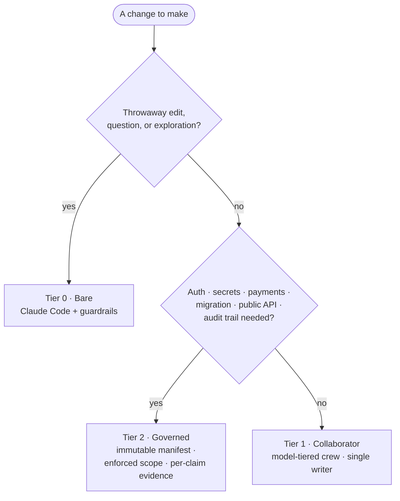

# Concepts: match oversight to blast radius

Most setups give an AI coding agent one fixed amount of process — the same
ceremony for a typo fix and a payment-system migration. Provost treats
**oversight as a dial**: you choose how much structure and accountability a
change gets, based on its *blast radius* — how much damage it could do and how
hard it would be to undo.

Provost is three tiers on that dial. All three run on vanilla Claude Code.

## The three tiers

| Tier | What it is | Use it for | What it costs you |
|---|---|---|---|
| **0 — Bare** | Just Claude Code with sensible guardrails; no crew, no ceremony. | Throwaway edits, questions, exploration. | Nothing — don't add process you don't need. |
| **1 — Collaborator** | A coordinated crew of model-tiered subagents with a single-writer discipline and a finite "Completion Contract." | Normal features and bug fixes. | A little planning; one active writer at a time. |
| **2 — Governed** | An immutable manifest, engine-enforced write scope, path custody, per-claim evidence, and a fresh-context verifier. | Auth, secrets, payments, migrations, public APIs, high blast radius, anything you'll be audited on. | Real ceremony — earned only when the risk justifies it. |

The point isn't to always use tier 2. It's to **stop paying tier-2 costs for
tier-0 work** — and to stop running tier-0 recklessness on tier-2 changes.

## The decision rule

Don't silently switch tiers mid-change. If a tier-1 change turns out riskier than
you thought, stop at a reviewable boundary and re-enter at tier 2.

## Tier 1: the collaborator crew

The collaborator tier ships as six subagent role files in
[`.claude/agents/`](../.claude/agents/), each pinning a model to match cost to the
job:

| Role | Model | Boundary |
|---|---|---|
| `explorer` | haiku | read-only: locate files, trace behavior, gather evidence |
| `implementer` | sonnet | foreground writer for a bounded TDD change |
| `implementer-deep` | opus | foreground writer for a genuinely complex bounded change |
| `test-analyst` | haiku | run existing tests; never edits |
| `code-reviewer` | opus | read-only correctness / security / regression review |
| `architecture-reviewer` | opus | read-only boundary / data-flow / operational review |

The orchestration policy in [`orchestration.md`](../orchestration.md) enforces the
discipline that makes this more than a pile of prompts: plan first, one active
writer at a time, up to three read-only roles concurrently, and a finite
**Completion Contract** that says what "done" means *before* work starts — so the
crew stops when the contract is met instead of gold-plating forever.

**Why the model tiering matters.** Cheap models (Haiku) do the grunt work —
searching, running tests. A capable mid model (Sonnet) does normal
implementation. The strongest model (Opus) is reserved for the things that
actually need judgment: orchestrating and reviewing. Run the main agent on Opus.
This is where the token savings come from — you're not paying Opus rates to grep
a codebase.

## Tier 2: governance

When the blast radius is high, agreed-upon discipline isn't enough — you want it
*enforced*, not just promised. The governed tier adds an immutable manifest,
hooks that block writes outside the declared scope at the engine level, path
custody for handoffs, per-claim evidence, and a fresh-context verifier that must
pass before completion. See [`governance/`](governance/) for the design and a
reference implementation.

**This tier is Provost's reason to exist.** The collaborator tier above is a
well-trodden pattern — see, for example,
[pilotfish](https://github.com/Nanako0129/pilotfish) (the cost angle) and
[claude-agent-team](https://github.com/ek33450505/claude-agent-team) (the
observability angle). Provost's distinct contribution is this governed tier:
proactive, engine-enforced scope and evidence-based completion. The three angles
combine cleanly — cost, record, and governance.

## Model-agnostic, router-agnostic

Provost is prompts, role definitions, and a governance design — none of it is
tied to a specific model or vendor. The examples use native Anthropic models
(Opus / Sonnet / Haiku) so anyone with Claude Code can reproduce them with zero
setup. Want to run other models behind Claude Code? Point it at any
Anthropic-compatible gateway with a router such as
[CC Switch](https://github.com/farion1231/cc-switch) or [CLIProxyAPI](https://github.com/router-for-me/CLIProxyAPI) — an external
choice Provost neither ships nor endorses. Provost is the crew and the process;
the router is just which engine they run on.
