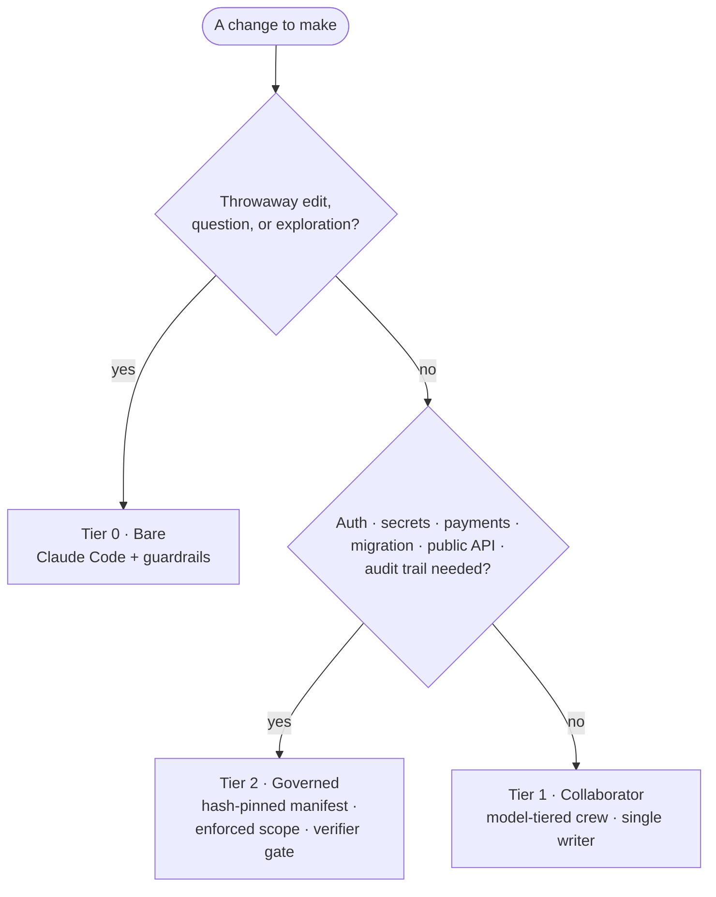

# Concepts: match oversight to blast radius

Most coding-agent setups apply one amount of process to every change. Provost
treats **oversight as a dial**: use only the structure justified by the damage a
change could cause and how difficult it would be to reverse.

## The three tiers

| Tier | What it is | Use it for | Cost |
|---|---|---|---|
| **0 — Bare** | Claude Code with local guardrails; no crew or governance runtime. | Throwaway edits, questions, exploration. | Minimal process. |
| **1 — Collaborator** | Coordinated roles, single-writer discipline, and a finite Completion Contract. | Normal features and bug fixes. | Planning and explicit completion evidence. |
| **2 — Governed** | Hash-pinned execution intent, machine-checked scope, custody, verification gates, and audit artifacts. | Auth, secrets, payments, migrations, public APIs, and audited work. | Substantial ceremony justified by risk. |

The point is not to always use Tier 2. It is to stop paying Tier 2 costs for
Tier 0 work—and to stop using Tier 0 controls for Tier 2 risks.

## The decision rule

Do not silently switch tiers mid-change. If Tier 1 work becomes riskier than
expected, stop at a reviewable boundary and re-plan it under Tier 2 controls.

## Tier 1: collaborator workflow

Tier 1 ships as six Claude Code role files in
[`../.claude/agents/`](../.claude/agents/) plus the policy in
[`../orchestration.md`](../orchestration.md):

| Role | Current model ID | Boundary |
|---|---|---|
| `explorer` | haiku | Read-only repository evidence |
| `implementer` | sonnet | Normal bounded implementation |
| `implementer-deep` | opus | Complex bounded implementation |
| `test-analyst` | haiku | Existing tests without source edits |
| `code-reviewer` | opus | Read-only correctness and security review |
| `architecture-reviewer` | opus | Read-only boundary and operational review |

The policy—not an engine lock—keeps one active writer, permits limited parallel
read-only work, and defines a finite Completion Contract before implementation.
The role files are usable today in Claude Code. Their model names are current
configuration, not a vendor-neutral runtime interface.

## Tier 2: governed reference design

Tier 2 separates two kinds of statements:

- **Design goals:** high-risk work should have pinned intent, enforced scope,
  path custody, evidence attached to completion claims, fresh verification, and
  reconstructable audit state.
- **Implemented reference behavior:** the PowerShell helper hashes manifests,
  maintains lifecycle state and custody, gates PASS on declared tasks, records
  failure and ledger state, and verifies handoff hashes. The write hook returns
  machine-readable deny decisions for disallowed file-tool targets.

Some goals are only partially implemented. In particular, the helper validates
acceptance declarations and accepts a task-level verification summary, but does
not validate a distinct evidence record for each claim. It also cannot prove a
verifier received a fresh context without the missing launcher. The exact
boundary is documented in the [capability matrix](governance/README.md).

## Why a hook differs from a prompt

A prompt asks the model to follow a boundary. A registered `PreToolUse` hook is
called by the host before a matching tool executes and can return a structured
deny decision. In the shipped reference write gate, unreadable or inconsistent
governed state fails closed. This is machine-enforced for the hooked file tools
when the integration is installed; it is not a general operating-system sandbox.

## Model and platform boundaries

The governance model is model-agnostic. The current reference host and
integrations target Claude Code: roles and hooks use Claude Code interfaces,
model IDs name Claude families, and Tier 2 code uses Windows PowerShell.
Cross-platform runtimes and additional host adapters are roadmap work, not
current capabilities.
